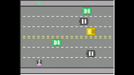

# Freeway

<h3>O projeto foi recriar o jogo clássico Freeway (lançado no ano de 1981)</h3>
 

## Demonstração

    </img>

## Deploy

**Link para testes:** <a target="_blank" href="https://freeway-tau.vercel.app/">https://freeway-tau.vercel.app/</a>

## Stack utilizada

**Front-end:** HTML, CSS e JavaScript

## Aprendizados

Densenvolvendo esse projeto, aprendi a trabalhar com listas, laços de repetição, e entender importância de dividir o código por responsabilidades, funções e retorno de função. Aprendendo o conceito básico de lógica de programação
